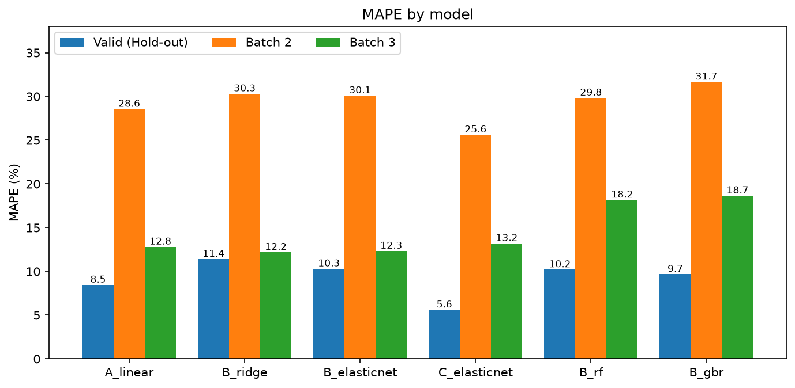
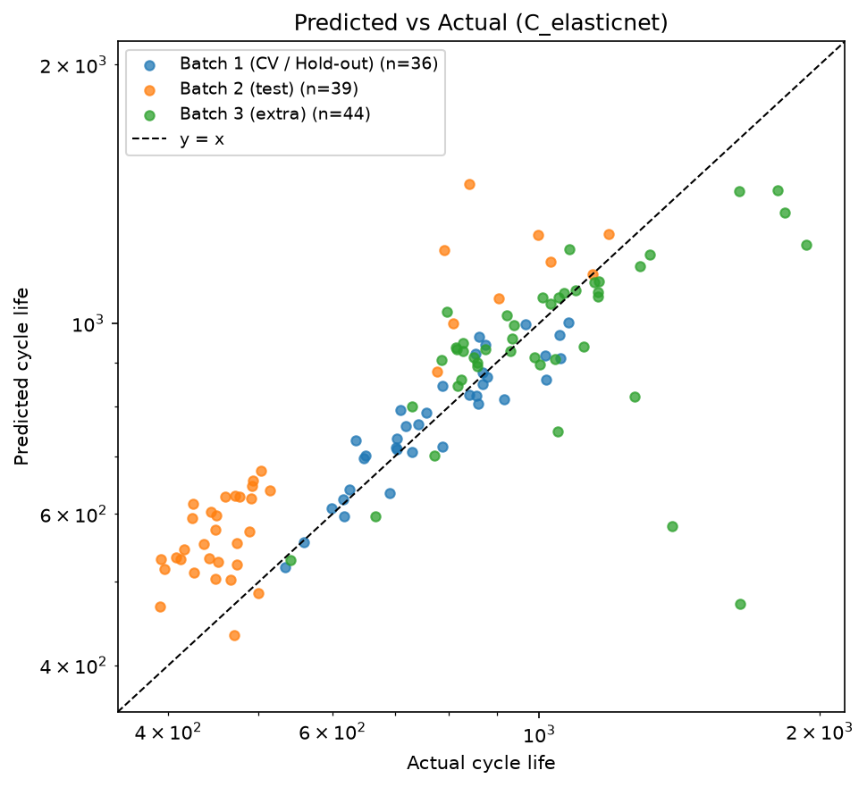
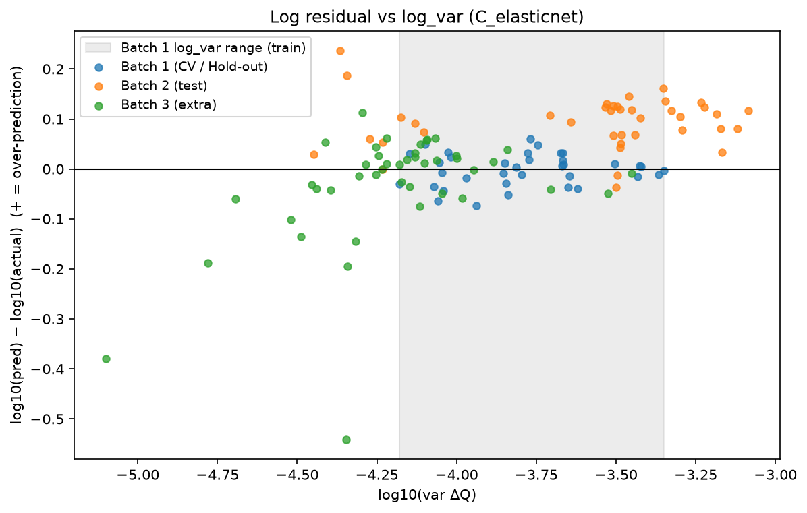

# ESS 배터리 수명 예측

초기 100사이클 데이터만으로 리튬이온 배터리의 수명(Cycle Life)을 예측하여,
ESS 운영에서 배터리 교체 시점 계획과 예지 보전(PdM)에 활용하는 것을 목표로 한다.

> 📓 **실험 기록** : [DAY2 실험 기록 (Log/DAY2_LOG.md)](Log/DAY2_LOG.md) — Step별 예상 → 결과 → 해석

## 프로젝트 개요

- 데이터셋 : MIT-Stanford Battery Dataset (Severson et al., Nature Energy 2019)
  - [Kaggle](https://www.kaggle.com/datasets/itshpark/data-driven-prediction-of-battery-cycle)
- 학습 데이터 : Batch 1 (2017-05-12, 36셀)
- 평가 데이터 : Batch 2 (2018-02-20, 39셀), 추가 검증 Batch 3 (2018-04-12, 44셀)
- 태스크 : **Regression** (타깃 : log10(Cycle Life)) — 선택 근거는 [모델 설계 전략](#day1-2단계-모델-설계-전략) 참고

## 파일 구조

```
├── data/
│   └── README.md               # 데이터 다운로드 안내 (.mat 파일은 git 제외)
├── processed/                  # 자동 생성 (git 제외)
│   ├── raw_b1~b3.pkl           #   배치별 추출 캐시
│   ├── battery_data.pkl        #   정제 결과 (셀 정보, 사이클 summary, Qdlin)
│   ├── features_day1.csv       #   DAY1 노트북 피처 (검증 기준값)
│   └── features.csv            #   셀 단위 초기 사이클 피처 (DAY2 입력)
├── src/
│   ├── preprocess.py           # 데이터 로드, 정제, 저장
│   ├── features.py             # 셀 단위 피처 계산 (ΔQ(V), 초기 사이클), 피처 세트 A/B/C
│   ├── split.py                # Batch 1 정책 단위 학습 / Hold-out 분할
│   ├── train.py                # 파이프라인, 모델 비교 (Step 3), Hold-out 반복 안정성 (Step 4)
│   ├── paper_split.py          # 논문 조건 근사 재현 (Batch 1+2 교대 분할)
│   └── evaluate.py             # 오류 분석 표·그래프
├── notebooks/
│   ├── 00_scratch.ipynb        # 전처리 결과 확인용 작업 노트북
│   ├── 01_EDA.ipynb            # DAY1 EDA (Q1~Q5)
│   └── 02_modeling.ipynb       # DAY2 오류 분석 (src.evaluate 호출)
├── models/                     # 학습된 모델 *.joblib (자동 생성, git 제외)
├── results/
│   ├── figures/                # EDA 그래프 (Q*), DAY2 그래프 (D2_*)
│   ├── split.json              # 학습 / Hold-out 셀 목록
│   ├── model_comparison.csv    # 모델별 Train / Valid / Batch 2 / Batch 3 MAPE
│   ├── model_performance.csv   # 성능표 (노션 포맷, 최종 C_elasticnet + 기준 A_linear)
│   ├── predictions.csv         # 모델 × 셀 예측
│   ├── holdout_repeats*.csv    # Hold-out 20회 반복 Valid MAPE
│   ├── paper_split_*.csv       # 논문 조건 근사 재현 결과
│   ├── error_*.csv             # 오류 분석 (Batch 2 구조별, Batch 3 노이즈 셀, 오차 상위 10셀)
│   └── c_elasticnet_coef.csv   # 최종 모델 계수, 배치별 상관, 반복 분할 선택 횟수
├── requirements.txt
└── README.md
```

## 환경 설정

```bash
git clone https://github.com/0l70/ess-battery-life
cd ess-battery-life
python3 -m venv .venv && source .venv/bin/activate     # Python 3.13
pip install -r requirements.txt
# data/README.md 안내에 따라 .mat 파일 3개를 data/ 에 배치
python -m src.preprocess       # processed/battery_data.pkl 생성 (최초 1회 .mat 로드, 수 분 소요)
python -m src.features         # processed/features.csv
python -m src.split            # results/split.json
python -m src.train            # 모델 비교 + Hold-out 반복 (--step 3 / --step 4 로 개별 실행)
python -m src.paper_split      # 논문 조건 근사 재현 (최종 + 기준 모델, --model 로 다른 모델 지정)
python -m src.evaluate         # 오류 분석 표·그래프, 최종 모델 계수표 (--model 로 다른 모델 지정)
# notebooks/02_modeling.ipynb : 위 결과 파일을 읽어 오류 분석 표·그래프 표시
```

---

## DAY1 진행 기록

| 단계  | 내용                          | 상태    |
| ----- | ----------------------------- | ------- |
| 0단계 | 데이터 준비 (`preprocess.py`) | ✅ 완료 |
| 1단계 | EDA Q1~Q5                     | ✅ 완료 |
| 2단계 | 모델 설계 전략                | ✅ 완료 |
| 3단계 | 설계 문서(PDF) 제출           | ✅ 완료 |

### 0단계. 데이터 준비 (`preprocess.py`)

**목적** : 2~3GB 크기의 `.mat` 파일을 매번 읽지 않도록, 필요한 정보만 추출·정제하여 캐시로 저장

**처리 흐름**

1. 배치별 `.mat` 로드 (MATLAB v7.3 → `mat73`) 후 필요한 정보만 추출
   - 셀 단위 : 충전 정책, `cycle_life`, `Vdlin`
   - 사이클 요약(summary) 전체 : QD, QC, IR, Tavg, Tmax, Tmin, chargetime
   - 사이클 1~100의 `Qdlin`, `Tdlin` (ΔQ(V) 계산용, float32)
2. 배치별 캐시 저장 → 재실행 시 `.mat`을 다시 읽지 않음
3. Batch 1 ↔ Batch 2 연속 셀 탐색 (정책 일치 + 용량 연속성 기준)
4. 사이클 단위 이상치 플래그 (행 삭제 없이 `is_outlier` 컬럼으로 표시)
5. EOL(0.88Ah) 도달 여부 검증 및 제외 셀 표시

**정제 규칙**

| 항목                        | 기준                                                                  |
| --------------------------- | --------------------------------------------------------------------- |
| 첫 사이클                   | QD = 0 인 빈 행 제거                                                  |
| 용량(QD, QC) 스파이크       | rolling median(11) 대비 ±0.05Ah 초과                                  |
| 충전시간, 내부저항 스파이크 | rolling median 대비 ±30% 초과                                         |
| 온도(Tavg, Tmax) 스파이크   | rolling median 대비 ±5℃ 초과                                          |
| EOL 판정                    | 0.88Ah (공칭 1.1Ah의 80%), 허용오차 0.005Ah                           |
| 타깃                        | 원본 `cycle_life` 사용 (QD 기반 계산값과 평균 2~6 사이클 차이로 검증) |

**셀 정제 결과**

| 배치                | 원본 | 제외 | 최종   | 제외 사유                                                  |
| ------------------- | ---- | ---- | ------ | ---------------------------------------------------------- |
| Batch 1 (학습)      | 46   | 10   | **36** | 실험 중단 5 (c0~c4), EOL 미도달 5 (c8, c10, c12, c13, c22) |
| Batch 2 (테스트)    | 47   | 8    | **39** | 다른 실험 프로토콜 (VarCharge, SLOWCYCLE), cycle_life 없음 |
| Batch 3 (추가 검증) | 46   | 2    | **44** | EOL 미도달 + cycle_life 없음 (c23, c32)                    |

**주요 결정**

- 실험 종료 방식이 배치마다 다름 : Batch 1·3은 0.88Ah 도달 직후 종료(마지막 용량 0.8801~0.881Ah), Batch 2는 약 0.83Ah까지 측정
  → EOL 판정에 허용오차(0.005Ah) 적용
- Batch 1 c0~c4 제외 : 실험 도중 중단된 셀(마지막 용량 0.97~1.04Ah). 원논문은 Batch 2의 이어지는 데이터로 병합했으나,
  Kaggle 파일에는 해당 데이터가 없음(Batch 2 최저 시작 용량 1.066Ah, 동일 정책 셀 없음) → 수명 미확인으로 제외
- Batch 1 EOL 미도달 5셀은 원논문 제외 목록과 일치 → 정제 결과 타당성 확인
- Batch 3 원논문 노이즈 셀(c2, c37, c42, c43) : summary 기준 이상치 비율 0~0.29%로 제외 근거 없음 → 유지 (평가 시 포함/제외 모두 보고)
- 원논문 대비 학습 셀 감소 : 41셀 → 36셀

**이슈 기록**

- `mat73` 로드 시 `MATLAB type not supported: string` 로그 대량 발생 → 분석과 무관한 문자열 필드(`barcode`, `channel_id`) 문제, 로그 숨김 처리
- 원논문 공개 코드의 셀 인덱스(Batch 2 = 48셀)가 Kaggle 파일(47셀)과 불일치 → 하드코딩 매핑 대신 데이터 기반 탐색으로 변경

### 1단계. EDA (`notebooks/01_EDA.ipynb`)

#### Q1. Cycle Life 분포


| 배치             | n   | 중앙값 | 범위       | skew | 550 기준 장수명 비율 |
| ---------------- | --- | ------ | ---------- | ---- | -------------------- |
| Batch 1 (학습)   | 36  | 772    | 534 ~ 1074 | 0.29 | 97%                  |
| Batch 2 (테스트) | 39  | 472    | 392 ~ 1186 | 1.57 | 23%                  |
| Batch 3 (추가)   | 44  | 1006   | 541 ~ 1935 | 1.21 | 98%                  |

- 배치별 분포가 모두 다름 (KS test, 모든 쌍 p < 0.001)
- **학습 범위가 테스트 범위를 덮지 못함** : Batch 2 대부분은 학습 최솟값(534) 미만, Batch 3 절반 이상은 학습 최댓값(1074) 초과 → 외삽 필요
- **셀 구조 효과** : Batch 1은 전부 기존 구조, Batch 3은 전부 newstructure, Batch 2는 혼재
  - Batch 2 기존 구조 30셀 평균 453 (392~514) vs newstructure 9셀 평균 942 (777~1186)
  - 같은 정책도 구조에 따라 수명 차이 (예: 4.8C(80%)-4.8C → 기존 437~514, newstructure 777~1029)
- Batch 2·3 충전시간은 약 10분으로 일정 (Batch 2 std 0.06분) → 충전시간은 테스트 배치에서 구분 신호가 없음
- 단수명 셀은 충전량 대부분을 5C 이상 고전류로 채우는 정책 (5.4C(80%)-5.4C, 3.6C(9%)-5C, 3.7C(31%)-5.9C)
- log10 변환 시 전체 skew 1.04 → 0.03

#### Q2. 열화 곡선


- 모든 배치에서 "완만한 구간 → 급락"의 비선형 열화 : 수명의 60~70%까지 용량 손실 3~5%, 이후 0.80~0.82까지 급락
- 말기(마지막 10%) 열화 속도가 중기(40~60%) 대비 약 11~12배
- Knee는 수명의 약 69~76% 지점에서 발생 (knee cycle과 수명 r = 0.99, 단 EOL까지의 데이터로 계산한 값이라 피처로 사용 불가)
- 초기 100사이클 용량은 거의 변화 없음(오히려 소폭 증가), 수명별 곡선이 섞여 구분 불가
- 초기 용량 감소량과 log 수명 상관 : Batch 1 -0.46 → Batch 2 0.17, Batch 3 0.13 (**테스트 배치에서 상관 소멸**)
- 배치별 초기 용량 기준이 다름 (Batch 2 약 1.10Ah, Batch 3 약 1.06Ah) → 용량 절대값 피처는 일반화 어려움

#### Q3. ΔQ(V) 곡선 (Q100 − Q10)


| ΔQ(V) 통계량    | Batch 1 r | Batch 2 r | Batch 3 r | 판단               |
| --------------- | --------- | --------- | --------- | ------------------ |
| log10(var ΔQ)   | -0.844    | -0.918    | -0.762    | **핵심 피처**      |
| log10\|min ΔQ\| | -0.821    | -0.901    | -0.744    | 보조 후보          |
| mean ΔQ         | 0.798     | 0.791     | 0.720     | 보조 후보          |
| skew ΔQ         | -0.434    | -0.126    | 0.188     | 제외 (부호 불안정) |
| kurtosis ΔQ     | 0.022     | 0.653     | 0.341     | 제외 (불안정)      |

(r : log10(Cycle Life)와의 Pearson 상관)

- 수명이 짧을수록 ΔQ(V) 곡선이 크게 벌어짐 (주로 3.0~3.2V 구간)
- **log10(var ΔQ)는 세 배치 모두에서 강한 음의 상관** → Q2의 용량 피처와 달리 배치를 넘어 일반화되는 신호
- Batch 1 단일 피처 직선(log 수명 = -0.30 × log var + 1.76)을 적용하면
  - Batch 2 newstructure, Batch 3 대부분은 직선 근처
  - **Batch 2 기존 구조 셀은 직선보다 일관되게 아래** (같은 var(ΔQ)에서 실제 수명이 더 짧음 → 과대예측 위험)
  - Batch 2 기존 구조 셀의 log var(-3.7 ~ -3.1)는 학습 범위(-4.2 ~ -3.35) 밖까지 분포 → 피처 축에서도 외삽
- Batch 3 노이즈 셀 중 2개는 var(ΔQ)가 매우 작아 학습 범위 밖에 위치

#### Q4. 충전 조건과 수명


| 조건 변수           | Batch 1 ρ | Batch 2 ρ | Batch 3 ρ | 판단        |
| ------------------- | --------- | --------- | --------- | ----------- |
| C1 (1단계 전류)     | -0.24     | 0.06      | -0.23     | 약함        |
| C2 (2단계 전류)     | -0.16     | -0.12     | 0.02      | 약함        |
| 평균 C-rate (0→80%) | -0.43     | 0.35      | -0.13     | 부호 뒤집힘 |
| 측정 충전시간       | 0.43      | -0.76     | 0.19      | 부호 뒤집힘 |
| 평균 최고온도       | -0.10     | -0.14     | -0.04     | 관계 없음   |

(ρ : log10(Cycle Life)와의 Spearman 상관)

- **충전 조건 변수는 수명과의 관계가 약하거나 배치마다 부호가 뒤집힘**
- Batch 2·3은 평균 C-rate가 전부 4.8C(= 0→80% 10분)로 같음 → 10분 충전 설계 확인. Batch 1만 4.0~5.4C로 다양
- Batch 2의 충전시간 상관(-0.76)은 셀 구조 효과 : newstructure 셀 10.04분 vs 기존 구조 약 10.17분 → 충전시간이 수명이 아니라 구조를 대신 나타낸 것 (가짜 상관)
- 정책별 수명
  - Batch 1 : 5.4C(80%)-5.4C가 가장 짧음(약 550), 정책 평균 550~1070
  - Batch 2 기존 구조 : 정책과 무관하게 전부 약 400~510 → 정책보다 구조·배치 영향이 큼
  - Batch 3 : 4.8C(80%)-4.8C가 가장 김(평균 약 1570), 3.7C(31%)-5.9C가 가장 짧음(약 660)
- 같은 정책 셀끼리는 수명이 비슷 → 정책이 학습·검증에 나뉘면 정보 누수
- 충전 전류 vs 열화 속도(Q2 중기·말기 기울기)도 배치마다 방향이 다름 : 평균 C-rate vs 말기 열화 Batch 1 ρ = 0.48, Batch 2 -0.27 / C2 vs 말기 열화 Batch 3 -0.53

#### Q5. 피처 상관관계와 다중공선성


**다중공선성 쌍 (Batch 1, |r| ≥ 0.9)**

| 피처 쌍                           | r      |
| --------------------------------- | ------ |
| QD_2 - fade_intercept_2_100       | 0.998  |
| log_var - log_abs_min             | 0.996  |
| QD_100_minus_2 - fade_slope_2_100 | 0.995  |
| log_abs_min - dQ_mean             | -0.977 |
| Tmax_mean - Tmax_max              | 0.976  |
| log_var - dQ_mean                 | -0.971 |
| Tavg_mean - Tmax_mean             | 0.953  |

**배치 일관성 (세 배치 모두 같은 부호, |r| ≥ 0.3)**

| 피처                   | Batch 1       | Batch 2      | Batch 3      | 판단                          |
| ---------------------- | ------------- | ------------ | ------------ | ----------------------------- |
| log_var                | -0.844        | -0.918       | -0.762       | 일관                          |
| log_abs_min            | -0.821        | -0.901       | -0.744       | 일관                          |
| dQ_mean                | 0.798         | 0.791        | 0.720        | 일관                          |
| chargetime_2_6         | 0.575         | **-0.942**   | 0.601        | 부호 뒤집힘 (구조 효과)       |
| fade_slope_2_100       | 0.552         | **-0.360**   | 0.432        | 부호 뒤집힘                   |
| QD_100_minus_2         | 0.519         | -0.166       | 0.371        | 불안정                        |
| 온도(Tavg, Tmax, Tmin) | -0.16 ~ -0.05 | -0.02 ~ 0.52 | -0.11 ~ 0.03 | 관계 없음                     |
| 내부저항(IR)           | 0.12 ~ 0.35   | 계산 불가    | -0.46 ~ 0.27 | Batch 2 결측·상수로 사용 불가 |

- 정제 데이터로 다시 계산한 결과, **배치를 넘어 일관된 피처는 ΔQ(V) 통계량 3개뿐**
- Batch 1에서만 상관이 높은 피처(충전시간 0.58, 용량 기울기 0.55)는 Batch 2에서 부호가 뒤집힘 → Batch 1 상관 순위만 보고 피처를 고르면 테스트에서 실패
- 일관 피처 3개의 VIF : log_abs_min 183, log_var 145, dQ_mean 23 → 사실상 같은 정보 (ΔQ 곡선이 벌어진 정도)
- Tavg-Tmax(0.95) 등 온도 피처끼리도 공선성이 높지만, 수명과의 관계 자체가 없어 제외

#### EDA → 모델링 연결 요약

| EDA 발견                                                         | 모델링 반영                                          |
| ---------------------------------------------------------------- | ---------------------------------------------------- |
| 550 기준 학습 배치 단수명 셀 1개 (Q1)                            | 분류 대신 **회귀**                                   |
| 수명 분포 우측 치우침, log-log 선형관계 (Q1, Q3)                 | 타깃 **log10(cycle_life)**                           |
| 학습 범위 밖 테스트 셀 다수 (Q1, Q3)                             | 외삽 가능한 **선형 모델** 우선, 트리 계열은 비교용   |
| log10(var ΔQ)가 세 배치 모두 강한 상관 (Q3)                      | **핵심 피처**                                        |
| 용량 감소량·충전시간은 테스트 배치에서 상관 소멸 (Q1, Q2)        | 조건·용량 절대값 피처는 배치 일관성 확인 후에만 사용 |
| 셀 구조(old/new)에 따라 수명 차이 (Q1, Q3)                       | Batch 2 오류 분석을 구조별로 분리                    |
| 같은 정책 셀끼리 수명 유사 (Q1, Q4)                              | 검증은 **정책 단위 GroupKFold**                      |
| 충전 조건·온도·IR은 배치 간 부호가 뒤집히거나 관계 없음 (Q4, Q5) | 조건 피처 **제외**                                   |
| 배치 일관 피처는 ΔQ 통계량 3개뿐, 서로 VIF 23~183 (Q5)           | 단일 피처 모델 + 정규화 모델로 비교                  |

### DAY1 2단계. 모델 설계 전략

#### 태스크 정의

- **Regression**, 타깃 = log10(Cycle Life), 입력 = 사이클 2~100 데이터에서 계산한 셀 단위 피처
- 예측값은 10^ŷ로 사이클 단위 복원 후 평가

#### 피처 설계

| 구분 | 피처                            | 근거                                                                      |
| ---- | ------------------------------- | ------------------------------------------------------------------------- |
| 핵심 | log10(var ΔQ)                   | Q3·Q5 : 세 배치 모두 \|r\| ≥ 0.76, 가장 강하고 일관됨                     |
| 보조 | log10\|min ΔQ\|, mean ΔQ        | Q5 : 배치 일관 (단, log var와 VIF 23~183 → 정규화 필요)                   |
| 제외 | skew/kurtosis ΔQ                | Q3 : 배치 간 부호 불안정                                                  |
| 제외 | 충전 정책 변수, 충전시간        | Q4·Q5 : 배치 간 부호 뒤집힘, Batch 2에서는 구조를 대신 나타내는 가짜 상관 |
| 제외 | 용량 곡선(기울기·감소량·절대값) | Q2·Q5 : Batch 2에서 부호 뒤집힘, 배치별 초기 용량 기준 상이               |
| 제외 | 온도                            | Q4·Q5 : 수명과 관계 없음 (\|r\| ≤ 0.17, Batch 2 Tmin 제외)                |
| 제외 | 내부저항                        | Q5 : Batch 2 결측·상수                                                    |

**피처 세트 (DAY2 비교 실험)**
| 세트 | 피처 | 목적 |
|---|---|---|
| A. Variance | log_var | 베이스라인 (원논문 variance model) |
| B. ΔQ | log_var, log_abs_min, dQ_mean | 메인 (일관 피처만, 정규화로 공선성 대응) |
| C. Full | Q5 피처 전체 (IR 제외) | 대조군 : 학습 배치에서만 상관 있는 피처를 넣으면 테스트 성능이 떨어지는지 확인 |

#### 데이터 처리 및 검증

- 학습 : Batch 1 (36셀) / 테스트 : Batch 2 (39셀, 메인), Batch 3 (44셀, 추가)
- Train (Batch 1 CV) : Batch 1을 정책 단위로 학습용(약 80%)과 Hold-out(약 20%)으로 나눈 뒤, 학습용에서 **정책 단위 GroupKFold**
- Valid (Batch 1 Hold-out) : CV에 쓰지 않은 정책 그룹으로 1회 검증 (같은 정책 셀이 학습·검증에 나뉘는 누수 방지)
- Test : 최종 모델을 Batch 1 전체로 재학습 후 Batch 2(필수), Batch 3(추가) 평가
- 스케일링 : `StandardScaler`를 `Pipeline` 안에 넣어 fold별 학습 데이터에만 fit
- 테스트 배치는 학습·튜닝에 일절 사용하지 않음

#### 후보 모델

| 모델                        | 역할       | 근거                                                                                |
| --------------------------- | ---------- | ----------------------------------------------------------------------------------- |
| 단일 피처 선형회귀 (세트 A) | 베이스라인 | 원논문 "variance model", Q3 선형관계                                                |
| ElasticNet (세트 B, C)      | 메인       | 원논문 모델, 소표본(36셀)·다중공선성(VIF 최대 183) 대응(L1+L2), 외삽 가능           |
| Ridge                       | 비교       | 다중공선성 대응, 계수 안정                                                          |
| Random Forest / XGBoost     | 비교       | 비선형 대응. 단 학습 범위 밖 예측 불가 → Batch 2·3 외삽 실패 여부를 확인하는 대조군 (DAY2에서 XGBoost → sklearn GradientBoosting으로 변경 : Mac libomp 설치 문제, 36셀 소표본이라 이득 없음) |

#### 평가

- 지표 : **MAPE**(메인, 원논문 비교). 사이클 단위 오차는 ESS 해석에서 MAE로 환산
- 보고 : Train(Batch 1 CV) / Valid(Batch 1 Hold-out) / Batch 2 / Batch 3, Batch 2는 구조별(old/new), Batch 3은 노이즈 셀 포함/제외
- 원논문 대비 조건 차이 : 원논문은 Batch 1+2를 섞어 학습(41셀 포함) → 본 프로젝트는 Batch 1만 학습하고 다른 배치로 평가하는 더 엄격한 조건이므로 원논문 성능(MAPE 9.1%)보다 오차가 클 것으로 예상

#### 예상 위험 요인

- Batch 2 기존 구조 셀의 체계적 과대예측 (Q3)
- 학습 범위 밖 외삽 (수명 축, 피처 축 모두)
- Batch 3 노이즈 셀의 극단적 피처 값

### DAY1 3단계. 설계 문서(PDF)

1. 개요 (목표, 데이터, 배치별 셀 수)
2. 전처리 (정제 규칙, 제외 셀과 사유)
3. EDA Q1~Q5 (그래프 + 해석 + 시사점)
4. EDA → 모델링 연결 요약표
5. 모델 설계 전략 (태스크, 피처, 검증, 후보 모델, 평가)

---

## 전처리·모델 선정 배경

> 배터리를 **처음 100번만 충방전해 보고**, 용량이 처음의 80%(0.88Ah)로 떨어지는 사이클(수명)을 맞히는 문제다. 아래는 단계마다 "다른 방법 대신 왜 이 방법인가"를 정리한 요약이다. 상세 근거는 DAY1 진행 기록과 [`Log/DAY2_LOG.md`](Log/DAY2_LOG.md) 참고.

### 1. 데이터 전처리

| 한 일 | 다른 선택지 | 이렇게 한 이유 |
| --- | --- | --- |
| 2~3GB `.mat`을 한 번만 읽고 필요한 값만 캐시로 저장 | 매번 원본 로드 | 로드에 수 분이 걸려 반복 실험이 어렵다 |
| 이상 사이클 행은 **삭제하지 않고 표시** (`is_outlier`) | 바로 삭제 | 무엇을 왜 뺐는지 추적할 수 있다. 피처 계산할 때만 제외한다 |
| 수명 끝까지 측정되지 않은 셀 제외 (Batch 1 46 → 36셀 등) | 그대로 사용 / 원논문처럼 다른 배치 데이터 이어붙이기 | 정답(수명)이 없는 셀은 학습할 수 없다. Kaggle 파일에는 이어붙일 데이터가 없다 |
| 피처는 **사이클 2~100 데이터로만** 계산 | 더 많은 사이클 사용 | 101번째 이후를 쓰면 미래를 보고 맞히는 누수다 (사이클 100 이후 데이터 미사용 검증 완료) |
| 타깃을 **log10(수명)**으로 변환 | 수명 그대로 | 분포가 오른쪽으로 치우쳐 있고(skew 1.04 → 0.03), 핵심 피처와 수명이 log-log 직선 관계다 |

### 2. 피처 : "배치가 바뀌어도 관계가 유지되는가"로 거름

| 후보 | log 수명 상관 (Batch 1 / 2 / 3) | 판단 |
| --- | --- | --- |
| **log_var** (사이클 10 vs 100 방전 곡선 차이 ΔQ(V)의 분산) | -0.84 / -0.92 / -0.76 | 세 배치 모두 강하고 같은 방향 → **핵심** |
| log_abs_min, dQ_mean (같은 곡선의 다른 통계) | 일관 | log_var와 거의 같은 정보 (VIF 23~183) |
| 충전 시간 | 0.57 / **-0.94** / 0.60 | 배치마다 부호가 뒤집힘 → 위험 |
| 용량 기울기, 초기 용량 | Batch 2에서 부호 반전 | 위험 |
| 온도, 내부저항 | 관계 없음 / Batch 2 결측 | 제외 |

→ 피처 세트 3개로 비교 : **A** = log_var 1개, **B** = ΔQ 통계 3개, **C** = 15개 전부(IR 제외, "위험한 피처를 넣으면 나빠지는가"를 보는 대조군)

### 3. 검증 설계

| 한 일 | 다른 선택지 | 이유 |
| --- | --- | --- |
| **Batch 1만 학습**, Batch 2·3은 처음 보는 데이터로 평가 | 원논문처럼 Batch 1+2를 섞어 학습 | 현장에서는 처음 보는 생산 로트를 예측해야 한다. 더 엄격하지만 현실에 가깝다 |
| **충전 정책 단위**로 학습 / 검증 분리 | 셀 단위 랜덤 분할 | 같은 정책 셀끼리 수명이 비슷해서 나뉘면 정답을 미리 본 셈이다 |
| Hold-out을 20번 다시 뽑아 흔들림 측정 | 한 번만 분할 | 검증 셀이 7개뿐이라 한 번의 결과는 ±2.5~3%p 흔들린다 |
| 테스트 배치는 모델 선택에 **사용하지 않음** | 테스트 점수가 좋은 모델 선택 | 테스트로 고르면 테스트 점수가 실제보다 좋게 나온다 |

### 4. 모델 후보 비교 (MAPE %)

| 모델 | 특징 | Valid | Batch 2 | Batch 3 | 평가 |
| --- | --- | --- | --- | --- | --- |
| **A_linear** (log_var, 직선) | 가장 단순, 원논문 variance 모델과 같은 발상 | 8.47 | 28.56 | **12.81** | 단순하지만 처음 보는 셀에 강건 |
| B_ridge / B_elasticnet (ΔQ 3개) | 같은 정보를 3개로 | 10.31~11.41 | 30.11~30.32 | 12.20~12.34 | A와 구분 안 됨, 추가 피처 이득 없음 |
| **C_elasticnet** (15개 + L1 자동 선택) | 불필요한 피처 계수를 0으로 만듦 | **5.61** | **25.63** | 13.21 | Batch 1 안에서 가장 정확 |
| B_rf / B_gbr (트리) | 비선형 대응, 학습 범위 밖 예측 불가 | 9.69~10.21 | 29.84~31.67 | 18.18~18.68 | 장수명 배치(Batch 3)에서 실패 : 수명 1000 이상 셀을 836~974로 예측 |

### 5. 최종 C_elasticnet, 기준 A_linear

1. **미리 정한 규칙을 따랐다** : Valid 최저, 1%p 이내면 더 단순한 모델. C 5.61%가 2위 A 8.47%보다 2.85%p 낮아 1%p 이내 모델이 없다
2. **우연이 아니다** : Hold-out을 20번 다시 뽑아도 C가 1위 16회, A보다 나은 경우 17/20
3. **테스트 결과로 바꾸지 않았다** : C가 Batch 3 노이즈 셀에서 48% 틀린 것은 테스트를 본 뒤에 안 사실이라 모델 교체 근거로 쓰지 않았다
4. **A를 기준으로 함께 보고한다** : 두 모델의 장단점이 엇갈린다

| | C (최종) | A (기준) |
| --- | --- | --- |
| Batch 1 안 정확도 (Valid) | ✅ 5.61 | 8.47 |
| Batch 2 평균 | ✅ 25.63 | 28.56 |
| 처음 보는 유형의 셀 (Batch 2 new) | 25.59 | ✅ 17.53 |
| 측정 노이즈 셀 (Batch 3 4셀) | 48.28 | ✅ 23.48 |

- C가 더 정확한 이유는 새 정보가 아니라, 여러 피처와 함께 학습하며 **log_var 기울기가 A보다 약 1.2배 가팔라진 것**이다. 이 기울기가 old 셀에는 유리하고 new 셀에는 불리했다
- C가 고른 dQ_kurt는 측정 노이즈에 약해 노이즈 셀을 크게 과소예측했다

> **요약** : 수명을 가장 잘 알려주는 신호는 사이클 10과 100의 방전 곡선 차이(log_var) 하나였다. 처음 보는 배치로 평가하는 엄격한 설계에서, 미리 정한 규칙대로 Batch 1 안에서 가장 정확한 **C_elasticnet**을 최종 모델로 골랐고, 처음 보는 셀에 더 강건한 가장 단순한 모델 **A_linear**를 기준으로 함께 보고한다.

---

## 성능 결과

> 실험별 예상 → 결과 → 판단 과정은 [`Log/DAY2_LOG.md`](Log/DAY2_LOG.md)에 기록했다. 각 실험은 실행 전에 예상을 먼저 적고, 결과를 본 뒤 해석했다.

- 최종 모델 : **C_elasticnet** (피처 세트 C, ElasticNet) — 선택 규칙(Valid MAPE 최저, 1%p 이내면 더 단순한 모델) 적용
- 기준 모델 : **A_linear** (피처 세트 A = log_var, LinearRegression)
- 출처 : `results/model_performance.csv`

| 구분                     | C_elasticnet (최종) | A_linear (기준) | 비고                           |
| ------------------------ | ------------------- | --------------- | ------------------------------ |
| Train (Batch 1 CV)       | 5.91                | 8.87            |                                |
| Valid (Batch 1 Hold-out) | 5.61                | 8.47            |                                |
| Test (Batch 2)           | 25.63               | 28.56           |                                |
| Gap (Train − Valid)      | -0.30               | -0.41           | (+) : 과적합 의심                   |
| Gap (Valid − Test)       | 20.02               | 20.09           | (+) : 배치 간 일반화 저하 의심           |
| Gap (Target − Test)      | 16.53               | 19.46           | Target : 원논문 9.1%              |
| Test (Batch 3)           | 13.21               | 12.81           |                                |
| Gap (Batch 2 − Batch 3)  | -12.41              | -15.75          | Test 성능 간 비교                   |

- 계산식 : Gap(Train − Valid) = Valid − Train, Gap(Valid − Test) = Batch 2 − Valid, Gap(Target − Test) = Batch 2 − 9.1, Gap(Batch 2 − Batch 3) = Batch 3 − Batch 2 → (+)는 뒤 항목에서 MAPE가 커짐
- Train : 학습 29셀에서 정책 단위 GroupKFold(5), best 파라미터의 fold 평균 / Valid : Hold-out 7셀 (4개 정책) / Test : Batch 1 전체 36셀로 재학습 후 평가

### 모델 비교 (`results/model_comparison.csv`, `results/holdout_repeats.csv`)

| 모델         | 피처 세트  | Train (CV) | Valid | Valid 20회 반복 (평균 ± std) | Batch 2 | Batch 3 | best params                                       |
| ------------ | ---------- | ---------- | ----- | ---------------------------- | ------- | ------- | ------------------------------------------------- |
| A_linear     | A_variance | 8.87       | 8.47  | 9.63 ± 2.55                  | 28.56   | 12.81   | –                                                 |
| B_ridge      | B_deltaQ   | 8.99       | 11.41 | 10.36 ± 2.65                 | 30.32   | 12.20   | alpha=10                                          |
| B_elasticnet | B_deltaQ   | 9.20       | 10.31 | 10.00 ± 2.48                 | 30.11   | 12.34   | alpha=0.0316, l1_ratio=0.1                        |
| C_elasticnet | C_full     | 5.91       | 5.61  | 6.66 ± 2.95                  | 25.63   | 13.21   | alpha=0.00316, l1_ratio=0.9                       |
| B_rf         | B_deltaQ   | 9.63       | 10.21 | 11.29 ± 3.20                 | 29.84   | 18.18   | max_depth=2, min_samples_leaf=2                   |
| B_gbr        | B_deltaQ   | 8.96       | 9.69  | 11.19 ± 4.45                 | 31.67   | 18.68   | learning_rate=0.05, max_depth=1, n_estimators=100 |

(MAPE %, 사이클 단위. Valid 20회 반복 : seed 0~19 정책 단위 분할, 모델 선택에는 사용하지 않음)



### 논문 비교 (`results/paper_split_comparison.csv`)

| 조건                                   | 모델         | 학습 셀 | 테스트 셀 | Train (CV) | Train (fit) | Test  | Secondary test (Batch 3) |
| -------------------------------------- | ------------ | ------- | --------- | ---------- | ----------- | ----- | ------------------------ |
| 논문식 근사 (Batch 1+2 교대 분할)      | C_elasticnet | 38      | 37        | 11.03      | 7.62        | 13.74 | 15.68                    |
| 우리 조건 (Batch 1만 학습, Test = B2)  | C_elasticnet | 36      | 39        | 5.91       | 4.61        | 25.63 | 13.21                    |
| 논문식 근사 (Batch 1+2 교대 분할)      | A_linear     | 38      | 37        | 15.61      | 14.20       | 13.19 | 13.12                    |
| 우리 조건 (Batch 1만 학습, Test = B2)  | A_linear     | 36      | 39        | 8.87       | 8.25        | 28.56 | 12.81                    |

(MAPE %. 논문식 근사 : Batch 1+2를 cell_id(배치, 셀 번호) 순 정렬 후 교대로 train / test 배정. 원논문은 b1c0~c4를 Batch 2로 이어붙인 셀을 포함했고 셀 인덱스도 달라 **완전 재현이 아닌 근사**.
Train (fit) : 학습 셀 in-sample, 우리 조건의 Train (CV)는 학습 29셀 기준)

**차이의 원인 (C_elasticnet 기준, Target 9.1%와의 차이 16.5%p 분해)**

> 주의 : 1단계는 우리 조건 Batch 2 **39셀**과 논문식 test의 Batch 2 **19셀**을 비교하므로 셀 집합이 다르다. 같은 19셀끼리 비교한 값은 아래 "같은 셀 비교"에 따로 적었다.

| 단계 | MAPE | 줄어든 폭 | 원인 |
| --- | --- | --- | --- |
| 우리 조건 Batch 2 | 25.63 | – | Batch 1만 학습, 처음 보는 배치로 평가 |
| 논문식 test 중 Batch 2 셀 | 17.81 | 7.8%p (같은 셀 기준 5.0%p) | **분할 조건** : Batch 2 셀 절반을 학습에 포함 (H6) |
| 논문식 test 전체 | 13.74 | 4.1%p | **test 구성** : 쉬운 Batch 1 셀이 test의 절반 (18/37셀) |
| 원논문 Target | 9.1 | 4.6%p | **데이터·분할 차이** : 이어붙인 장수명 셀 5개(b1c0~c4) 부재, 셀 인덱스 차이, 피처 구성 차이 (이번 실험으로 분리 못 함) |

- A_linear 기준으로는 13.2%p(분할, 같은 셀 기준 13.1%p) + 2.2%p(test 구성) + 4.1%p(나머지)
- **같은 셀 비교** (논문식 test의 Batch 2 19셀만) : 우리 조건 C 22.82% → 논문식 C 17.81%, 우리 조건 A 28.52% → 논문식 A 15.39%. 이 차이가 셀 구성 영향을 뺀 분할 조건 효과다
- 분할 조건 효과에는 "Batch 2 셀을 학습에서 본 효과"와 "test 셀의 충전 정책을 학습에서 본 효과"(35/37셀)가 섞여 있어 둘을 나누지 못했다
- 원논문 조건에서는 test 37셀 중 35셀의 충전 정책이 train에도 있다. 같은 배치·같은 정책을 학습한 상태에서의 성능이다
- 셀 구조(H5) : 우리 조건의 Batch 2 오차 대부분은 학습에 없던 old 구조 셀에서 나온다 (아래 오류 분석)
- 원논문은 대표 성능(test MAPE 9.1%)만 비교했다. 모델별 수치(variance / discharge / full)는 원문을 확인하지 못해 비교하지 않았다

---

## 가설별 결과

| # | 질문 | 예상 | 결과 | 판정 |
| --- | --- | --- | --- | --- |
| H1 | log_var 하나로 논문 variance 모델 수준이 나오는가? | Valid 8~10%, B2 20~25%, B3 12~18% | Valid 8.47, B2 28.56, B3 12.81 | 논문 variance 모델 수치 미확인으로 직접 비교 불가. 자체 예상 기준으로는 Valid·B3 맞음, B2는 예상보다 나쁨 |
| H2 | ΔQ 보조 피처를 추가하면 나아지는가? | A와 ±1%p 이내 | 20회 반복 평균 차이 +0.37~0.73%p, B2·B3도 1~2%p 이내 | 맞음 (이득 없음) |
| H3 | 학습 배치 전용 피처를 넣으면 테스트가 나빠지는가? | Valid 비슷, B2는 B보다 확실히 나쁨 | Valid 5.61 (최저), B2 25.63 (B보다 4.5%p 좋음), B3 13.21 | 틀림 (위험은 다른 곳에서 드러남) |
| H4 | 트리 모델은 학습 범위 밖에서 실패하는가? | B2·B3 모두 선형보다 나쁨 | B3 18.2~18.7 (선형 12.2~12.3), B2 29.8~31.7 (선형 30.1) | 반만 맞음 |
| H5 | Batch 2 오차는 셀 구조 차이에서 오는가? | old 셀 과대예측이 오차 상위 대부분 | A : old 31.87 vs new 17.53, old 30/30 과대예측 | 맞음 |
| H6 | 논문과의 성능 차이는 분할 조건 때문인가? | 논문식 분할 시 10~15% | 논문식 test 13.19~13.74 | 맞음 (분할 조건 + test 구성이 Target과의 차이의 약 3/4) |

**H1. log_var 단독**
- Batch 1 안(Valid 8.47%)과 Batch 3(12.81%, 노이즈 셀 제외 11.75%)에서는 log_var와 수명의 관계가 거의 그대로 유지된다
- Batch 2는 old 셀이 log 잔차 +0.12(약 32%)만큼 일관되게 과대예측돼 28.56%가 됐다. log_var의 "방향"은 배치를 넘어 유지되지만, 셀 구조가 바뀌면 "절편"이 이동한다

**H2. ΔQ 보조 피처**
- B_elasticnet은 계수를 log_var(-0.060)에 몰고 나머지 둘은 거의 0으로 만들었다. 사실상 단일 피처 모델이다
- DAY1의 "세 피처는 같은 정보(VIF 23~183)" 판단이 그대로 확인됐다

**H3. 학습 배치 전용 피처 (C 세트)**
- 우려한 충전시간·용량 기울기는 L1이 0으로 만들었다. 실제로 쓴 피처는 log_var, QD_2, QD_max_minus_2, dQ_kurt 4개다
- Batch 2 old 개선은 새 피처가 아니라 **log_var 기울기가 A보다 1.2배 가팔라진 효과**다. QD_2와 QD_max_minus_2는 old 셀에서 서로 상쇄됐다
- 같은 기울기가 Batch 2 new(17.53 → 25.59)에는 불리했고, 불안정 피처 dQ_kurt가 Batch 3 노이즈 셀을 크게 과소예측하게 만들었다
- "학습 배치 전용 정보는 위험하다"는 방향은 맞았지만, 위험은 평균 MAPE가 아니라 처음 보는 유형의 셀에서 드러났다

**H4. 트리 모델 외삽**
- Batch 2·3 예측이 586~974로 학습 수명 범위(534~1074) 안에 갇혀 Batch 3 장수명 셀에서 크게 틀렸다
- Batch 2에서는 선형도 old 셀을 전부 과대예측해서 "외삽 가능"의 이점이 나타나지 않았다. 선형 외삽은 관계의 절편이 유지될 때만 이점이다

**H5. Batch 2 셀 구조** → 아래 오류 분석

**H6. 논문 조건** → 위 논문 비교 "차이의 원인"

---

## 오류 분석

최종 모델 C_elasticnet, 기준 모델 A_linear (`results/error_*.csv`, `results/c_elasticnet_coef.csv`)

**Batch 2 구조별 MAPE (%)** (괄호 : 과대예측 셀 수)

| 모델 | old (30셀) | new (9셀) |
| --- | --- | --- |
| C_elasticnet | 25.64 (28/30) | 25.59 (8/9) |
| A_linear | 31.87 (30/30) | 17.53 (8/9) |
| B_elasticnet | 34.41 (30/30) | 15.79 (6/9) |
| B_rf | 34.96 (30/30) | 12.78 (5/9) |
| B_gbr | 37.71 (30/30) | 11.51 (5/9) |

**Batch 3 노이즈 셀(b3c2, c37, c42, c43) 포함 / 제외 MAPE (%)**

| 모델 | 포함 (44셀) | 제외 (40셀) | 노이즈 4셀만 |
| --- | --- | --- | --- |
| C_elasticnet | 13.21 | 9.71 | 48.28 |
| A_linear | 12.81 | 11.75 | 23.48 |

**오차 상위 10셀 (C_elasticnet, Batch 2·3)**

| cell_id | 구조 | 실제 | 예측 | APE (%) | log_var | 방향 |
| --- | --- | --- | --- | --- | --- | --- |
| b2c44 | new | 841 | 1452 | 72.6 | -4.365 | 과대 |
| b3c42 | new | 1642 | 472 | 71.3 | -4.346 | 과소 |
| b3c37 | new | 1390 | 581 | 58.2 | -5.099 | 과소 |
| b2c9 | new | 791 | 1217 | 53.9 | -4.344 | 과대 |
| b2c31 | old | 425 | 616 | 44.9 | -3.352 | 과대 |
| b2c2 | old | 424 | 593 | 39.8 | -3.460 | 과대 |
| b2c13 | old | 460 | 629 | 36.7 | -3.344 | 과대 |
| b3c38 | new | 1935 | 1235 | 36.2 | -4.342 | 과소 |
| b2c4 | old | 444 | 604 | 36.0 | -3.233 | 과대 |
| b3c2 | new | 1267 | 821 | 35.2 | -4.779 | 과소 |

(Batch 1 학습 log_var 범위 -4.179 ~ -3.350 → 10셀 중 8셀이 범위 밖. A_linear 상위 10셀은 Batch 2 old 과대예측 8셀)

**C_elasticnet 피처별 기여 (log10, 계수 × z, Batch 1 평균 셀 대비 그룹 평균)**

| 그룹 | log_var | QD_2 | QD_max_minus_2 | dQ_kurt | 합 | A_linear |
| --- | --- | --- | --- | --- | --- | --- |
| Batch 2 old | -0.142 | +0.046 | -0.042 | -0.002 | -0.140 | -0.117 |
| Batch 2 new | +0.168 | +0.030 | +0.002 | -0.028 | +0.172 | +0.138 |
| Batch 3 | +0.145 | -0.039 | +0.021 | -0.042 | +0.086 | +0.120 |




- **Batch 2 오차는 셀 구조에서 온다 (H5).** 기준 모델 A는 old 30셀을 전부 과대예측했다. Q3에서 본 "같은 log_var에서 old 셀의 수명이 더 짧다"가 그대로 오차가 됐고, Batch 2 39셀 중 11셀은 log_var가 학습 범위 위쪽이라 피처 축 외삽도 겹친다
- **C에서 old·new MAPE가 같아진 것은 구조 효과가 사라진 것이 아니다.** 가파른 log_var 기울기가 old 예측은 낮추고 new 예측은 올려 평균이 비슷해졌다
- **Batch 3 상위 4셀 중 3셀(b3c42, c37, c2)은 dQ_kurt 때문에 틀렸다.** 세 셀 모두 원논문 노이즈 셀이다. log_var는 예측을 +0.20 ~ +0.47(log10) 올려 "장수명"을 맞게 가리켰지만, dQ_kurt가 -0.32 ~ -0.46 끌어내렸다. 노이즈 셀은 곡선 모양 통계량에 특히 취약하다
- **나머지 1셀(b3c38, 실제 1935)은 log_var 관계 자체의 한계다.** dQ_kurt 영향은 거의 없고(-0.007), log_var 기여(+0.20)가 실제 수명에 필요한 값(+0.40)의 절반이다. A_linear도 1130으로 예측했다
- 두 배치 모두 큰 오차는 **학습 배치에서 본 적 없는 유형의 셀**에서 생긴다

---

## 시사점

**데이터 관점 : 배치·구조가 바뀌면 무엇이 깨지는가**
- 깨지지 않는 것 : ΔQ(V) 분산과 수명의 음의 log-log 관계. 세 배치 모두 상관 -0.76 ~ -0.92로 방향이 유지된다
- 깨지는 것 ① 절편 : 같은 log_var에서 old 구조 셀의 수명이 Batch 1 관계보다 약 24% 짧다 (A_linear log 잔차 평균 +0.118). 학습에 없던 구조는 피처가 같아도 수명이 다르다
- 깨지는 것 ② 학습 배치에서만 성립한 상관 : 충전시간, 용량 기울기, QD_2, QD_max_minus_2는 Batch 2에서 상관 부호가 뒤집힌다
- 깨지는 것 ③ 측정 품질 : 노이즈 채널 셀에서는 곡선 모양 통계량(kurtosis)이 크게 흔들린다
- Batch 1 안의 Valid(5.6%)와 Batch 2(25.6%)의 20%p 차이는 과적합이 아니라(Gap Train−Valid -0.3%p) **배치 간 분포 이동**에서 온다

**모델 관점 : 왜 이 모델·피처를 골랐는가**
- 최종 모델 C_elasticnet : 테스트를 보기 전에 정한 규칙(Valid 최저, 1%p 이내면 단순 모델)으로 골랐다. Valid 5.61%로 2위보다 2.85%p 낮고, 20회 반복 분할에서도 1위 16회, A보다 나은 분할 17/20이라 우연이 아니다
- 테스트 결과(Batch 3 노이즈 셀 48%)를 근거로 모델을 바꾸지 않았다. 그렇게 하면 테스트로 모델을 고르는 것이 된다
- 기준 모델 A_linear를 함께 보고하는 이유 : **평균 성능은 C, 처음 보는 셀에 대한 강건성은 A**라는 트레이드오프가 있다 (노이즈 셀 48.28% vs 23.48%, Batch 2 new 25.59% vs 17.53%)
- 정규화(L1)는 피처 선택을 대신해 주지 않는다. 우려한 피처는 걸렀지만 다른 불안정 피처를 골랐다. 배치 일관성 기준의 사전 피처 선택이 여전히 필요하다
- 트리 모델은 학습 수명 범위 밖을 예측하지 못해 장수명 배치(Batch 3)에서 18%대로 나빴다

**한계와 다음에 해볼 것**
- 학습 36셀, Hold-out 7셀로 표본이 작다. Valid는 분할에 따라 표준편차 2.5~4.5%p 흔들린다
- 논문 조건 재현은 근사다 (이어붙인 셀 5개 없음, 셀 인덱스 차이). 남은 4~5%p의 원인을 분리하지 못했다
- "newstructure"의 물리적 의미(셀·실험 조건 변경)는 데이터로 확인할 수 없다
- 예측 구간(불확실성)을 내지 않았다
- 다음에 해볼 것
  - 새 배치 셀 몇 개로 절편만 보정했을 때 Batch 2 MAPE가 얼마나 줄어드는지 (로트 재보정 실험)
  - 배치 일관 피처만 쓴 C 세트 변형 (QD_2, QD_max_minus_2, dQ_kurt 제외)
  - 부트스트랩·분위 회귀로 예측 구간 제시
  - 사이클 10/100 대신 더 이른 사이클(예 : 10/50)로 예측했을 때 정확도와 확보 기간의 트레이드오프

---

## ESS 도메인 해석

**오차를 사이클 수로 환산하면** (평균 절대오차, 사이클)

| 구분 | 실제 수명 중앙값 | C_elasticnet MAE | A_linear MAE | C 평균 편향 |
| --- | --- | --- | --- | --- |
| Batch 1 Hold-out | 870 | 46 | 72 | -4 |
| Batch 2 old | – | 115 | 143 | +112 (과대) |
| Batch 2 new | – | 222 | 147 | +222 (과대) |
| Batch 2 전체 | 472 | 140 | 144 | – |
| Batch 3 | 1006 | 163 (최대 1170) | 151 | -91 (과소) |

- 같은 셀 구조 안에서는 약 50사이클 오차로 교체 시점을 계획할 수 있지만, 처음 보는 로트에서는 오차가 140~163사이클(하루 1사이클 운전 가정 시 약 5개월)로 커진다
- **오차 방향이 비용을 가른다.** 과대예측(Batch 2)은 교체가 늦어져 계획되지 않은 용량 부족·정지로 이어지고, 과소예측(Batch 3)은 멀쩡한 셀을 일찍 교체하는 비용이 된다. ESS에서는 과대예측이 더 위험한데, 우리 모델은 처음 보는 구조(Batch 2 old)에서 일관되게 과대예측했다

**100사이클을 확보하는 데 걸리는 기간** (운전 조건은 일반적인 가정이며 데이터에서 나온 값이 아님)
- 하루 1회 완전 충방전으로 운전한다고 가정하면 약 100일(3~4개월), 하루 2회면 약 50일이다
- 단 실험 데이터는 10분 급속충전 + 완전 방전 사이클이다. 실제 ESS는 충전 속도가 느리고 부분 충방전(DoD < 100%)이 많아서, 실험의 100사이클과 운전 일수가 그대로 대응하지 않는다 (등가 완전 사이클 기준으로 환산 필요)

**진단 사이클이 필요하다**
- 핵심 피처 ΔQ(V)는 사이클 10과 100에서 정전류 완전 방전한 Q(V) 곡선의 차이다. 부분 충방전 위주의 ESS 운전 데이터로는 계산할 수 없다
- 시운전 직후와 약 100 등가 사이클 시점에 같은 조건의 정전류 완전 방전(진단 사이클)을 넣어야 한다
- Batch 3 노이즈 셀 결과처럼 측정 품질이 나쁘면 곡선 통계량이 크게 흔들린다. 진단 사이클의 전압·전류 측정 정밀도를 관리해야 한다

**제조 로트가 바뀌면 재보정이 필요하다**
- 같은 log_var에서도 구조(로트)가 다르면 수명이 약 24% 짧았다 (Batch 2 old). 한 로트로 만든 모델을 새 로트에 그대로 쓰면 체계적 편향이 생긴다
- 논문식 조건처럼 Batch 2 셀 20개를 학습에 넣자 Batch 2 test 셀 MAPE가 A_linear 기준 15.39%로 낮아졌다 (같은 19셀 기준 우리 조건 28.52%). 새 로트 정보를 학습에 넣으면 오차가 크게 줄어든다는 것은 확인했다
- 다만 20셀은 실제 운영에서 쓰기 어려운 규모다. **몇 셀이면 충분한지는 확인하지 못했다** (한계·다음에 해볼 것의 로트 재보정 실험)
- 운영 절차로는 새 로트의 일부 셀을 가속 수명 시험으로 EOL까지 돌려 절편을 재보정하는 방식을 생각할 수 있다 (가정)
- 재보정 전까지는 과대예측 위험을 고려해 예측 수명을 보수적으로(짧게) 잡는 운영 기준을 둔다

## 참고문헌

- Severson et al. (2019). Data-driven prediction of battery cycle life before capacity degradation. _Nature Energy_, 4, 383–391.

## 팀 구성

- 이경민 (울산캠퍼스 4반) : 데이터 전처리, EDA, 피처 엔지니어링, 모델 개발, 성능 평가(Batch 2·3)
