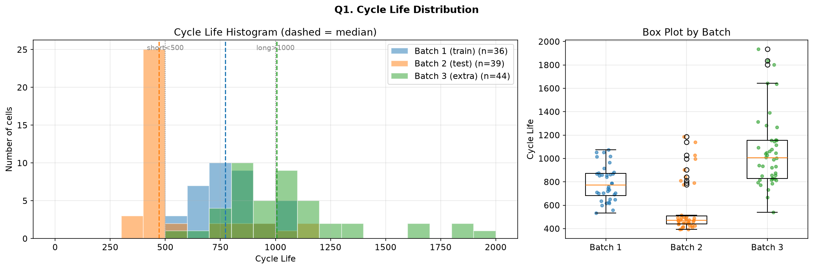
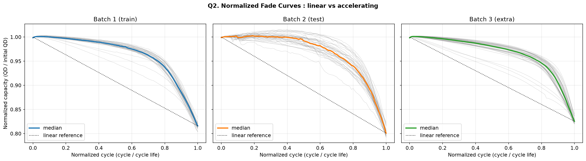
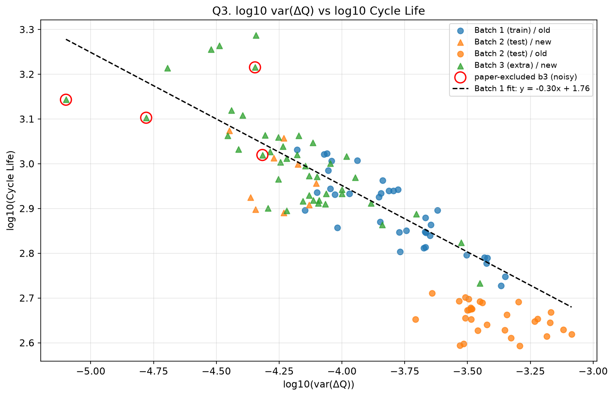
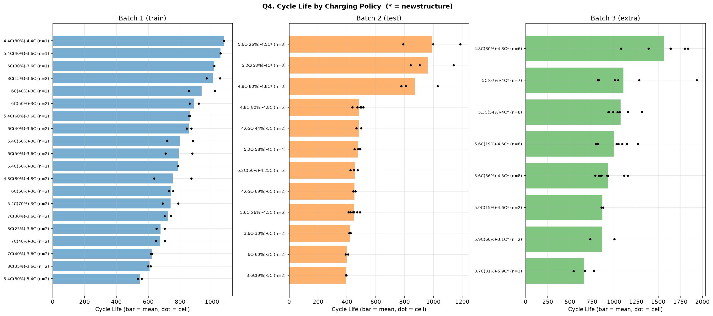
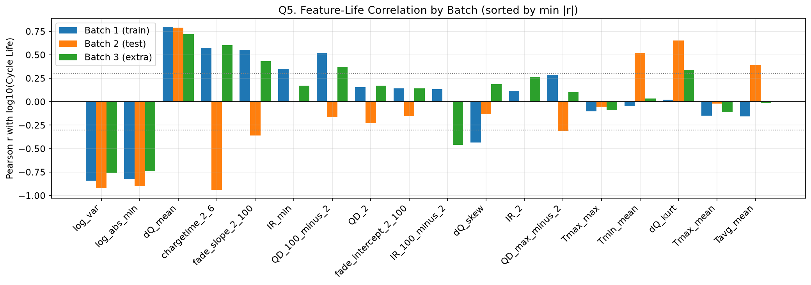

# ESS 배터리 수명 예측

초기 100사이클 데이터만으로 리튬이온 배터리의 수명(Cycle Life)을 예측하여,
ESS 운영에서 배터리 교체 시점 계획과 예지 보전(PdM)에 활용하는 것을 목표로 한다.


## 프로젝트 개요
- 데이터셋 : MIT-Stanford Battery Dataset (Severson et al., Nature Energy 2019)
  - [Kaggle](https://www.kaggle.com/datasets/itshpark/data-driven-prediction-of-battery-cycle)
- 학습 데이터 : Batch 1 (2017-05-12, 36셀)
- 평가 데이터 : Batch 2 (2018-02-20, 39셀), 추가 검증 Batch 3 (2018-04-12, 44셀)
- 태스크 : **Regression** (타깃 : log10(Cycle Life)) — 선택 근거는 [모델 설계 전략](#day1-2단계-모델-설계-전략) 참고


## 파일 구조
```
├── data/
│   └── README.md               # 데이터 다운로드 안내 (.mat 파일은 git 제외)
├── processed/                  # 자동 생성 (git 제외)
│   ├── raw_b1~b3.pkl           #   배치별 추출 캐시
│   ├── battery_data.pkl        #   정제 결과 (셀 정보, 사이클 summary, Qdlin)
│   └── features_day1.csv       #   셀 단위 초기 사이클 피처 (DAY2 입력)
├── notebooks/
│   └── 01_EDA.ipynb            # DAY1 EDA (Q1~Q5)
├── results/
│   └── figures/                # EDA 그래프
├── preprocess.py               # 데이터 로드, 정제, 저장
├── requirements.txt
└── README.md
```


## 환경 설정
```bash
git clone https://github.com/<아이디>/ess-battery-life
cd ess-battery-life
python3 -m venv .venv && source .venv/bin/activate     # Python 3.13
pip install -r requirements.txt
# data/README.md 안내에 따라 .mat 파일 3개를 data/ 에 배치
python preprocess.py                                     # processed/battery_data.pkl 생성
# notebooks/01_EDA.ipynb 실행 → processed/features_day1.csv 생성
```


---

## DAY1 진행 기록

| 단계 | 내용 | 상태 |
|---|---|---|
| 0단계 | 데이터 준비 (`preprocess.py`) | ✅ 완료 |
| 1단계 | EDA Q1~Q5 | ✅ 완료 |
| 2단계 | 모델 설계 전략 | ✅ 완료 |
| 3단계 | 설계 문서(PDF) 제출 | ⬜ 예정 |


### 0단계. 데이터 준비 (`preprocess.py`)

**목적** : 2~3GB 크기의 `.mat` 파일을 매번 읽지 않도록, 필요한 정보만 추출·정제하여 캐시로 저장

**처리 흐름**
1. 배치별 `.mat` 로드 (MATLAB v7.3 → `mat73`) 후 필요한 정보만 추출
   - 셀 단위 : 충전 정책, `cycle_life`, `Vdlin`
   - 사이클 요약(summary) 전체 : QD, QC, IR, Tavg, Tmax, Tmin, chargetime
   - 사이클 1~100의 `Qdlin`, `Tdlin` (ΔQ(V) 계산용, float32)
2. 배치별 캐시 저장 → 재실행 시 `.mat`을 다시 읽지 않음
3. Batch 1 ↔ Batch 2 연속 셀 탐색 (정책 일치 + 용량 연속성 기준)
4. 사이클 단위 이상치 플래그 (행 삭제 없이 `is_outlier` 컬럼으로 표시)
5. EOL(0.88Ah) 도달 여부 검증 및 제외 셀 표시

**정제 규칙**

| 항목 | 기준 |
|---|---|
| 첫 사이클 | QD = 0 인 빈 행 제거 |
| 용량(QD, QC) 스파이크 | rolling median(11) 대비 ±0.05Ah 초과 |
| 충전시간, 내부저항 스파이크 | rolling median 대비 ±30% 초과 |
| 온도(Tavg, Tmax) 스파이크 | rolling median 대비 ±5℃ 초과 |
| EOL 판정 | 0.88Ah (공칭 1.1Ah의 80%), 허용오차 0.005Ah |
| 타깃 | 원본 `cycle_life` 사용 (QD 기반 계산값과 평균 2~6 사이클 차이로 검증) |

**셀 정제 결과**

| 배치 | 원본 | 제외 | 최종 | 제외 사유 |
|---|---|---|---|---|
| Batch 1 (학습) | 46 | 10 | **36** | 실험 중단 5 (c0~c4), EOL 미도달 5 (c8, c10, c12, c13, c22) |
| Batch 2 (테스트) | 47 | 8 | **39** | 다른 실험 프로토콜 (VarCharge, SLOWCYCLE), cycle_life 없음 |
| Batch 3 (추가 검증) | 46 | 2 | **44** | EOL 미도달 + cycle_life 없음 (c23, c32) |

**주요 결정**
- 실험 종료 방식이 배치마다 다름 : Batch 1·3은 0.88Ah 도달 직후 종료(마지막 용량 0.8801~0.881Ah), Batch 2는 약 0.83Ah까지 측정
  → EOL 판정에 허용오차(0.005Ah) 적용
- Batch 1 c0~c4 제외 : 실험 도중 중단된 셀(마지막 용량 0.97~1.04Ah). 원논문은 Batch 2의 이어지는 데이터로 병합했으나,
  Kaggle 파일에는 해당 데이터가 없음(Batch 2 최저 시작 용량 1.066Ah, 동일 정책 셀 없음) → 수명 미확인으로 제외
- Batch 1 EOL 미도달 5셀은 원논문 제외 목록과 일치 → 정제 결과 타당성 확인
- Batch 3 원논문 노이즈 셀(c2, c37, c42, c43) : summary 기준 이상치 비율 0~0.29%로 제외 근거 없음 → 유지 (평가 시 포함/제외 모두 보고)
- 원논문 대비 학습 셀 감소 : 41셀 → 36셀

**이슈 기록**
- `mat73` 로드 시 `MATLAB type not supported: string` 로그 대량 발생 → 분석과 무관한 문자열 필드(`barcode`, `channel_id`) 문제, 로그 숨김 처리
- 원논문 공개 코드의 셀 인덱스(Batch 2 = 48셀)가 Kaggle 파일(47셀)과 불일치 → 하드코딩 매핑 대신 데이터 기반 탐색으로 변경


### 1단계. EDA (`notebooks/01_EDA.ipynb`)

#### Q1. Cycle Life 분포


| 배치 | n | 중앙값 | 범위 | skew | 550 기준 장수명 비율 |
|---|---|---|---|---|---|
| Batch 1 (학습) | 36 | 772 | 534 ~ 1074 | 0.29 | 97% |
| Batch 2 (테스트) | 39 | 472 | 392 ~ 1186 | 1.57 | 23% |
| Batch 3 (추가) | 44 | 1006 | 541 ~ 1935 | 1.21 | 98% |

- 배치별 분포가 모두 다름 (KS test, 모든 쌍 p < 0.001)
- **학습 범위가 테스트 범위를 덮지 못함** : Batch 2 대부분은 학습 최솟값(534) 미만, Batch 3 절반 이상은 학습 최댓값(1074) 초과 → 외삽 필요
- **셀 구조 효과** : Batch 1은 전부 기존 구조, Batch 3은 전부 newstructure, Batch 2는 혼재
  - Batch 2 기존 구조 30셀 평균 453 (392~514) vs newstructure 9셀 평균 942 (777~1186)
  - 같은 정책도 구조에 따라 수명 차이 (예: 4.8C(80%)-4.8C → 기존 437~514, newstructure 777~1029)
- Batch 2·3 충전시간은 약 10분으로 일정 (Batch 2 std 0.06분) → 충전시간은 테스트 배치에서 구분 신호가 없음
- 단수명 셀은 충전량 대부분을 5C 이상 고전류로 채우는 정책 (5.4C(80%)-5.4C, 3.6C(9%)-5C, 3.7C(31%)-5.9C)
- log10 변환 시 전체 skew 1.04 → 0.03

#### Q2. 열화 곡선


- 모든 배치에서 "완만한 구간 → 급락"의 비선형 열화 : 수명의 60~70%까지 용량 손실 3~5%, 이후 0.80~0.82까지 급락
- 말기(마지막 10%) 열화 속도가 중기(40~60%) 대비 약 11~12배
- Knee는 수명의 약 69~76% 지점에서 발생 (knee cycle과 수명 r = 0.99, 단 EOL까지의 데이터로 계산한 값이라 피처로 사용 불가)
- 초기 100사이클 용량은 거의 변화 없음(오히려 소폭 증가), 수명별 곡선이 섞여 구분 불가
- 초기 용량 감소량과 log 수명 상관 : Batch 1 -0.46 → Batch 2 0.17, Batch 3 0.13 (**테스트 배치에서 상관 소멸**)
- 배치별 초기 용량 기준이 다름 (Batch 2 약 1.10Ah, Batch 3 약 1.06Ah) → 용량 절대값 피처는 일반화 어려움

#### Q3. ΔQ(V) 곡선 (Q100 − Q10)


| ΔQ(V) 통계량 | Batch 1 r | Batch 2 r | Batch 3 r | 판단 |
|---|---|---|---|---|
| log10(var ΔQ) | -0.844 | -0.918 | -0.762 | **핵심 피처** |
| log10\|min ΔQ\| | -0.821 | -0.901 | -0.744 | 보조 후보 |
| mean ΔQ | 0.798 | 0.791 | 0.720 | 보조 후보 |
| skew ΔQ | -0.434 | -0.126 | 0.188 | 제외 (부호 불안정) |
| kurtosis ΔQ | 0.022 | 0.653 | 0.341 | 제외 (불안정) |

(r : log10(Cycle Life)와의 Pearson 상관)

- 수명이 짧을수록 ΔQ(V) 곡선이 크게 벌어짐 (주로 3.0~3.2V 구간)
- **log10(var ΔQ)는 세 배치 모두에서 강한 음의 상관** → Q2의 용량 피처와 달리 배치를 넘어 일반화되는 신호
- Batch 1 단일 피처 직선(log 수명 = -0.30 × log var + 1.76)을 적용하면
  - Batch 2 newstructure, Batch 3 대부분은 직선 근처
  - **Batch 2 기존 구조 셀은 직선보다 일관되게 아래** (같은 var(ΔQ)에서 실제 수명이 더 짧음 → 과대예측 위험)
  - Batch 2 기존 구조 셀의 log var(-3.7 ~ -3.1)는 학습 범위(-4.2 ~ -3.35) 밖까지 분포 → 피처 축에서도 외삽
- Batch 3 노이즈 셀 중 2개는 var(ΔQ)가 매우 작아 학습 범위 밖에 위치

#### Q4. 충전 조건과 수명


| 조건 변수 | Batch 1 ρ | Batch 2 ρ | Batch 3 ρ | 판단 |
|---|---|---|---|---|
| C1 (1단계 전류) | -0.24 | 0.06 | -0.23 | 약함 |
| C2 (2단계 전류) | -0.16 | -0.12 | 0.02 | 약함 |
| 평균 C-rate (0→80%) | -0.43 | 0.35 | -0.13 | 부호 뒤집힘 |
| 측정 충전시간 | 0.43 | -0.76 | 0.19 | 부호 뒤집힘 |
| 평균 최고온도 | -0.10 | -0.14 | -0.04 | 관계 없음 |

(ρ : log10(Cycle Life)와의 Spearman 상관)

- **충전 조건 변수는 수명과의 관계가 약하거나 배치마다 부호가 뒤집힘**
- Batch 2·3은 평균 C-rate가 전부 4.8C(= 0→80% 10분)로 같음 → 10분 충전 설계 확인. Batch 1만 4.0~5.4C로 다양
- Batch 2의 충전시간 상관(-0.76)은 셀 구조 효과 : newstructure 셀 10.04분 vs 기존 구조 약 10.17분 → 충전시간이 수명이 아니라 구조를 대신 나타낸 것 (가짜 상관)
- 정책별 수명
  - Batch 1 : 5.4C(80%)-5.4C가 가장 짧음(약 550), 정책 평균 550~1070
  - Batch 2 기존 구조 : 정책과 무관하게 전부 약 400~510 → 정책보다 구조·배치 영향이 큼
  - Batch 3 : 4.8C(80%)-4.8C가 가장 김(평균 약 1570), 3.7C(31%)-5.9C가 가장 짧음(약 660)
- 같은 정책 셀끼리는 수명이 비슷 → 정책이 학습·검증에 나뉘면 정보 누수

#### Q5. 피처 상관관계와 다중공선성


**다중공선성 쌍 (Batch 1, |r| ≥ 0.9)**

| 피처 쌍 | r |
|---|---|
| QD_2 - fade_intercept_2_100 | 0.998 |
| log_var - log_abs_min | 0.996 |
| QD_100_minus_2 - fade_slope_2_100 | 0.995 |
| log_abs_min - dQ_mean | -0.977 |
| Tmax_mean - Tmax_max | 0.976 |
| log_var - dQ_mean | -0.971 |
| Tavg_mean - Tmax_mean | 0.953 |

**배치 일관성 (세 배치 모두 같은 부호, |r| ≥ 0.3)**

| 피처 | Batch 1 | Batch 2 | Batch 3 | 판단 |
|---|---|---|---|---|
| log_var | -0.844 | -0.918 | -0.762 | 일관 |
| log_abs_min | -0.821 | -0.901 | -0.744 | 일관 |
| dQ_mean | 0.798 | 0.791 | 0.720 | 일관 |
| chargetime_2_6 | 0.575 | **-0.942** | 0.601 | 부호 뒤집힘 (구조 효과) |
| fade_slope_2_100 | 0.552 | **-0.360** | 0.432 | 부호 뒤집힘 |
| QD_100_minus_2 | 0.519 | -0.166 | 0.371 | 불안정 |
| 온도(Tavg, Tmax, Tmin) | -0.16 ~ -0.05 | -0.02 ~ 0.52 | -0.11 ~ 0.03 | 관계 없음 |
| 내부저항(IR) | 0.12 ~ 0.35 | 계산 불가 | -0.46 ~ 0.27 | Batch 2 결측·상수로 사용 불가 |

- 정제 데이터로 다시 계산한 결과, **배치를 넘어 일관된 피처는 ΔQ(V) 통계량 3개뿐**
- Batch 1에서만 상관이 높은 피처(충전시간 0.58, 용량 기울기 0.55)는 Batch 2에서 부호가 뒤집힘 → Batch 1 상관 순위만 보고 피처를 고르면 테스트에서 실패
- 일관 피처 3개의 VIF : log_abs_min 183, log_var 145, dQ_mean 23 → 사실상 같은 정보 (ΔQ 곡선이 벌어진 정도)
- Tavg-Tmax(0.95) 등 온도 피처끼리도 공선성이 높지만, 수명과의 관계 자체가 없어 제외

#### EDA → 모델링 연결 요약

| EDA 발견 | 모델링 반영 |
|---|---|
| 550 기준 학습 배치 단수명 셀 1개 (Q1) | 분류 대신 **회귀** |
| 수명 분포 우측 치우침, log-log 선형관계 (Q1, Q3) | 타깃 **log10(cycle_life)** |
| 학습 범위 밖 테스트 셀 다수 (Q1, Q3) | 외삽 가능한 **선형 모델** 우선, 트리 계열은 비교용 |
| log10(var ΔQ)가 세 배치 모두 강한 상관 (Q3) | **핵심 피처** |
| 용량 감소량·충전시간은 테스트 배치에서 상관 소멸 (Q1, Q2) | 조건·용량 절대값 피처는 배치 일관성 확인 후에만 사용 |
| 셀 구조(old/new)에 따라 수명 차이 (Q1, Q3) | Batch 2 오류 분석을 구조별로 분리 |
| 같은 정책 셀끼리 수명 유사 (Q1, Q4) | 검증은 **정책 단위 GroupKFold** |
| 충전 조건·온도·IR은 배치 간 부호가 뒤집히거나 관계 없음 (Q4, Q5) | 조건 피처 **제외** |
| 배치 일관 피처는 ΔQ 통계량 3개뿐, 서로 VIF 23~183 (Q5) | 단일 피처 모델 + 정규화 모델로 비교 |


### DAY1 2단계. 모델 설계 전략

#### 태스크 정의
- **Regression**, 타깃 = log10(Cycle Life), 입력 = 사이클 2~100 데이터에서 계산한 셀 단위 피처
- 예측값은 10^ŷ로 사이클 단위 복원 후 평가

#### 피처 설계
| 구분 | 피처 | 근거 |
|---|---|---|
| 핵심 | log10(var ΔQ) | Q3·Q5 : 세 배치 모두 \|r\| ≥ 0.76, 가장 강하고 일관됨 |
| 보조 | log10\|min ΔQ\|, mean ΔQ | Q5 : 배치 일관 (단, log var와 VIF 23~183 → 정규화 필요) |
| 제외 | skew/kurtosis ΔQ | Q3 : 배치 간 부호 불안정 |
| 제외 | 충전 정책 변수, 충전시간 | Q4·Q5 : 배치 간 부호 뒤집힘, Batch 2에서는 구조를 대신 나타내는 가짜 상관 |
| 제외 | 용량 곡선(기울기·감소량·절대값) | Q2·Q5 : Batch 2에서 부호 뒤집힘, 배치별 초기 용량 기준 상이 |
| 제외 | 온도 | Q4·Q5 : 수명과 관계 없음 (\|r\| ≤ 0.17, Batch 2 Tmin 제외) |
| 제외 | 내부저항 | Q5 : Batch 2 결측·상수 |

**피처 세트 (DAY2 비교 실험)**
| 세트 | 피처 | 목적 |
|---|---|---|
| A. Variance | log_var | 베이스라인 (원논문 variance model) |
| B. ΔQ | log_var, log_abs_min, dQ_mean | 메인 (일관 피처만, 정규화로 공선성 대응) |
| C. Full | Q5 피처 전체 (IR 제외) | 대조군 : 학습 배치에서만 상관 있는 피처를 넣으면 테스트 성능이 떨어지는지 확인 |

#### 데이터 처리 및 검증
- 학습 : Batch 1 (36셀) / 테스트 : Batch 2 (39셀, 메인), Batch 3 (44셀, 추가)
- 검증 : Batch 1 내부 **정책 단위 GroupKFold** (같은 정책 셀이 학습·검증에 나뉘어 들어가는 누수 방지)
- 스케일링 : `StandardScaler`를 `Pipeline` 안에 넣어 fold별 학습 데이터에만 fit
- 테스트 배치는 학습·튜닝에 일절 사용하지 않음

#### 후보 모델
| 모델 | 역할 | 근거 |
|---|---|---|
| 단일 피처 선형회귀 (세트 A) | 베이스라인 | 원논문 "variance model", Q3 선형관계 |
| ElasticNet (세트 B, C) | 메인 | 원논문 모델, 소표본(36셀)·다중공선성(VIF 최대 183) 대응(L1+L2), 외삽 가능 |
| Ridge | 비교 | 다중공선성 대응, 계수 안정 |
| Random Forest / XGBoost | 비교 | 비선형 대응. 단 학습 범위 밖 예측 불가 → Batch 2·3 외삽 실패 여부를 확인하는 대조군 |

#### 평가
- 지표 : **MAPE**(메인, 원논문 비교), RMSE(사이클), R²
- 보고 : Valid(GroupKFold) / Batch 2 / Batch 3, Batch 2는 구조별(old/new), Batch 3은 노이즈 셀 포함/제외
- 원논문 대비 조건 차이 : 원논문은 Batch 1+2를 섞어 학습(41셀 포함) → 본 프로젝트는 Batch 1만 학습하고 다른 배치로 평가하는 더 엄격한 조건이므로 원논문 성능(MAPE 9.1%)보다 오차가 클 것으로 예상

#### 예상 위험 요인
- Batch 2 기존 구조 셀의 체계적 과대예측 (Q3)
- 학습 범위 밖 외삽 (수명 축, 피처 축 모두)
- Batch 3 노이즈 셀의 극단적 피처 값


### DAY1 3단계. 설계 문서(PDF)
1. 개요 (목표, 데이터, 배치별 셀 수)
2. 전처리 (정제 규칙, 제외 셀과 사유)
3. EDA Q1~Q5 (그래프 + 해석 + 시사점)
4. EDA → 모델링 연결 요약표
5. 모델 설계 전략 (태스크, 피처, 검증, 후보 모델, 평가)

---


## 성능 결과
(DAY2 작성)

| Model | Valid MAPE | Batch 2 MAPE | Batch 3 MAPE | Gap (Valid − Batch 2) |
|---|---|---|---|---|
| | | | | |


## 오류 분석
(DAY2 작성)


## ESS 도메인 해석
(DAY2 작성)


## 참고문헌
- Severson et al. (2019). Data-driven prediction of battery cycle life before capacity degradation. *Nature Energy*, 4, 383–391.


## 팀 구성
- 이경민 :
- (팀원) :
